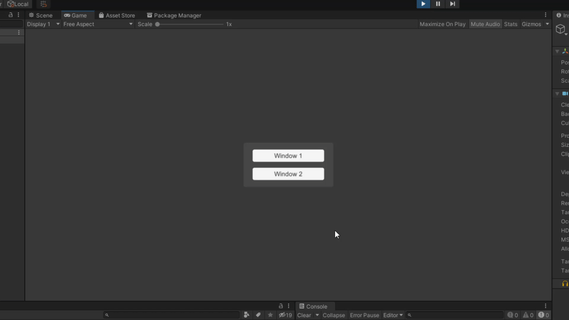
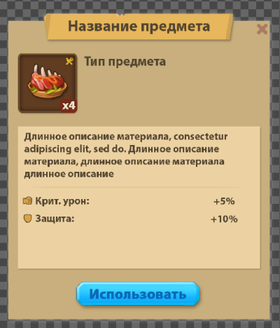
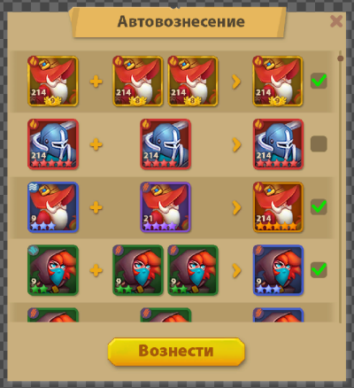

# Тестовое задание для тех. дизайнера

## Исходные данные

- Сцена: **Ui-Scene** (*Assets/Scenes/Ui-Scene.unity*)
- Макеты: **макет_1.psd **(*Assets/Resources/макет1.psd*) и **макет_2.psd** (*Assets/Resources/макет2.psd*)
- Шрифт: **PTSans.ttf** *(Assets/Resources/PTSans.ttf)*
- Префабы: **Window_1.prefab** (*Assets/Prefabs/Window_1.prefab*) и **Window_2.prefab** (*Assets/Prefabs/Window_2.prefab*)

При запуске сцены появится вот такое пустое меню:

### Скриншоты макетов:

 

## Требуется

На основе макетов сформировать 2 соответствующих префаба.

**Важные замечания по реализации:**

- Открытые в рантайме окна должны быть визуально неотличимы от окон с макета. Допускаются небольшие несоответствия в еле уловимых деталях по типу теней, кернинге, масках, цветах.
- Все тексты должны отображаться через TextMeshPro.
- Должна быть возможность заменить любую иконку/текст/картинку на аналогичную, в соответствующем ей объекте, без затрагивания других визуальных элементов. Примеры: выключить иконку ножа и вилки справа-сверху от еды на 1 макете, изменить заголовок окна, поменять текст процентов, изменить количество звезд и их цвет в карточке героев и т.п.
- Повторно использующийся и структурно схожий контент вынести в отдельные префабы. Пример: карточки героев - изменяя размер одной карточки, размер остальных должен измениться соответственно, но картинки героев, при этом, должны остаться разными. Допускается использование префаб-вариантов.
- Адаптивность холста и элементов. Окна должны корректно отображаться на самых популярных соотношениях сторон, а элементы подразумевающие внутренние изменения (подложки под тексты, поочередное отображение карточек и звездочек в них и т.п.) должны адаптироваться исходя из логики их отображения, например: если в карточке героя с 5 звездами выключить одну по середине, то звезды автоматически съедут вправо. Еще пример: подложка заголовка подстраивается под размер текста (9-slicing).
- **По макету 2:** должен содержать в себе скроллер. Первые строки скроллера должны соответствовать макету, а остальные (вне зоны видимости) - по желанию. Переключатели с галочкой должны быть интерактивными: иметь возможность включения/выключения. При выключении одной из центральных карточек героя, если их две (пример: 1 строка), оставшаяся должна сдвигаться в центр (пример: 2 строка).

**Не обязательно, будет плюсом:**

- Разбить и настроить текстуры по атласам, по своему усмотрению.
- Сделать окно по макету 1 полностью адаптивным. Чтобы при его вертикальном и горизонтальном растягивании элементы подстраивались под новый размер. Поведение элементов при растягивании на ваше усмотрение.
- Реализовать переход в главное меню сцены по нажатию на окнах крестика или основной кнопки.